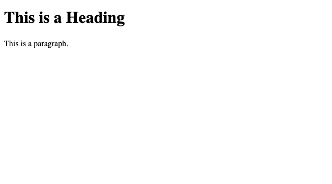

footer: Building a website with python @ Pythonistas
slidenumbers: true


---

## `whoami`

Lance Stephens

* [DevOps Engineer](https://www.linkedin.com/in/lancestephens/)
* Pretty okay Pythonista 🐍
* Extracurriculars include:
  * Community organizing with [Pythonistas](https://www.meetup.com/pythonistas/) (founder) and [Coffee & Code](https://www.meetup.com/okccoffeeandcode/)
  * Going to concerts
  * Travel


^ John Muir once said that Mount Rainier was “the most luxuriant and most extravagantly beautiful of all the alpine gardens I ever beheld in all my mountain-top wanderings.”

^ https://www.treehugger.com/mount-rainier-national-park-facts-5213246

^ https://www.nps.gov/articles/john-muir-and-his-efforts-to-preserve-mount-rainier.htm

---

## Agenda

* What is FastHTML?
* Why FastHTML?
* Overview
* Demo
* Practicum

---

## Agenda

* What will _not_ be covered (at least in the deck):
  * Python basics
  * Git/GitHub
  * DNS

^ ofc I'll be happy to answer questions about these topics afterward ❤️

---

## What is FastHTML?

FastHTML is a Python library that abstracts lower level HTML, CSS, JavaScript, and HTMX in a Pythonic way.

---

[.autoscale: false]
[.text: Courier, text-scale(0.9), line-height(1.0)]

## What is FastHTML?

From the [offical docs](https://docs.fastht.ml/):

FastHTML is a new next-generation web framework for fast, scalable web applications with minimal, compact code. It’s designed to be:

* Powerful and expressive enough to build the most advanced, interactive web apps you can imagine.
* Fast and lightweight, so you can write less code and get more done.

---

[.autoscale: false]
[.text: Courier, text-scale(1.0), line-height(1.0)]

## What is FastHTML?

* Easy to learn and use, with a simple, intuitive syntax that makes it easy to build complex apps quickly.

---

[.autoscale: false]
[.text: Courier, text-scale(1.0), line-height(1.0)]

## What is FastHTML?

FastHTML apps are just Python code, so you can use FastHTML with the full power of the Python language and ecosystem.  

FastHTML’s functionality maps 1:1 directly to **HTML** and **HTTP**, but allows them to be encapsulated using good software engineering practices — so **you’ll need to understand these foundations to use this library fully** [emphasis mine].

---

[.autoscale: false]
[.text: Courier, text-scale(1.0), line-height(1.0)]

## Features

* [FastTags](https://docs.fastht.ml/explains/explaining_xt_components.html): 1:1 mapping of HTML tags
* [PicoCSS](https://docs.fastht.ml/api/pico.html): simplified CSS components similar to Tailwind
* [MiniDataAPI Spec](https://docs.fastht.ml/explains/minidataapi.html): simpler database wrapper API
* [OAuth](https://docs.fastht.ml/explains/oauth.html): single sign-on
* [Routes](https://docs.fastht.ml/explains/routes.html): server-side routing similar to FastAPI and Flask
* [WebSockets](https://docs.fastht.ml/explains/websockets.html): two-way persistent connections

---

## Why FastHTML?

* Gentler learning curve compared to traditional web development (HTML, CSS, JavaScript, Node.js, etc.)
* Easy transition from other Python web frameworks.
* Reactive websites are easier to build and maintain.
* More functionality compared to static sites.

---

## Overview

---

### HTML

---

[.autoscale: false]
[.code: Hack Nerd Font Mono, text-scale(2.0), line-height(1.1)]
[.code-highlight: none]
[.code-highlight: 1,2,10]
[.code-highlight: 3-5]
[.code-highlight: 6-9]
[.code-highlight: all]

```html
<!DOCTYPE html>
<html>
    <head>
        <title>Page Title</title>
    </head>
    <body>
        <h1>This is a Heading</h1>
        <p>This is a paragraph.</p>
    </body>
</html> 
```



^ [HTML Tutorial](https://www.w3schools.com/html/default.asp)

---

### CSS

---

[.autoscale: false]
[.code: Hack Nerd Font Mono, text-scale(2.0), line-height(1.1)]
[.code-highlight: none]
[.code-highlight: 1-3]
[.code-highlight: 5-9]
[.code-highlight: 10-13]
[.code-highlight: all]

```css
body {
  background-color: lightblue;
}

h1 {
  color: white;
  text-align: center;
}

p {
  font-family: verdana;
  font-size: 20px;
}
```


^ Simple CSS selectors mapped to the HTML example (name, ID, and class)

^ [CSS Tutorial](https://www.w3schools.com/css/default.asp)


---

### JavaScript

---

[.autoscale: false]
[.code: Hack Nerd Font Mono, text-scale(2.0), line-height(1.1)]
[.code-highlight: none]
[.code-highlight: 1-5,7-11]
[.code-highlight: 6]
[.code-highlight: all]

```html
<!DOCTYPE html>
<html>
    <body>
        <h2>My First JavaScript</h2>
        <button type="button"
            onclick="document.getElementById('demo').innerHTML = Date()">
            Click me to display Date and Time.
        </button>
        <p id="demo"></p>
    </body>
</html> 
```


^ Inline JavaScript that traverses the DOM and updates the innerHTML with the current date and time

^ [JavaScript Tutorial](https://www.w3schools.com/js/default.asp)

---

### HTMX

(JavaScript* one more time with feeling)

---

### What is HTMX

[.autoscale: false]
[.text: Courier, text-scale(0.9), line-height(1.0)]

From the [docs](https://htmx.org/):

htmx gives you access to **AJAX**, **CSS Transitions**, **WebSockets** and **Server Sent Events** directly in HTML, using attributes, so you can build modern user interfaces with the simplicity and power of **hypertext**

htmx is small (~14k min.gz’d), dependency-free, extendable & has reduced code base sizes by 67% when compared with react

---

[.autoscale: false]
[.code: Hack Nerd Font Mono, text-scale(2.0), line-height(1.1)]
[.code-highlight: none]
[.code-highlight: 1-2,6-8,12-16]
[.code-highlight: 3-5]
[.code-highlight: 9-11]
[.code-highlight: all]

```html
<!DOCTYPE html>
<html>
    <head>
        <script src="https://unpkg.com/htmx.org@1.9.10"></script>
    </head>
    <body>
        <h2>My First HTMX</h2>
        <button 
            hx-get="/time"  
            hx-target="#demo"
            hx-trigger="click">
            Click me to display Date and Time.
        </button>
        <p id="demo"></p>
    </body>
</html>
```


^ These are the same as the javascript example

^ Starting with the `<head><script src...>` import and followed by the `hx-` HTMX attributes

^ [</> htmx ~ Reference](https://htmx.org/reference/)

---

## Circling back to FastHTML

---

## HTML, CSS, and **JavaScript** in FastHTML

---

[.autoscale: false]
[.code: Hack Nerd Font Mono, text-scale(2.0), line-height(1.1)]
[.code-highlight: none]
[.code-highlight: 1-2]
[.code-highlight: 4-5]
[.code-highlight: 6-10]
[.code-highlight: 11-17]
[.code-highlight: 19-32]
[.code-highlight: 33]
[.code-highlight: all]

```python
from fasthtml.common import *
from pathlib import Path

css = Path("style.css").read_text()

javascript = """
function updateDateTime() {
    document.getElementById('demo').innerHTML = new Date().toLocaleString();
}
"""

app, rt = fast_app(
    hdrs=(
        Style(css),
        Script(javascript),
    )
)

@rt("/")
def get():
    return Titled("Page Title",        
        H1("This is a Heading"),
        P("This is a paragraph"),
        
        H2("Date/Time Display"),
        Button(
            "Click me to display Date and Time", 
            onclick="updateDateTime()"
        ),
        P(id="demo")
    )

serve()
```


^ html, css, and js in FastHTML

---

## HTML, CSS, and **HTMX** in FastHTML

---

[.autoscale: false]
[.code: Hack Nerd Font Mono, text-scale(2.0), line-height(1.1)]
[.code-highlight: none]
[.code-highlight: 1-2]
[.code-highlight: 4-5]
[.code-highlight: 6-21]
[.code-highlight: 22-25]
[.code-highlight: 27]
[.code-highlight: all]

```python
from fasthtml.common import *
from datetime import datetime

app, rt = fast_app()

@rt("/")
def get():
    return Titled("Page Title",
        Style("""
            body { background-color: lightblue; }
            h1 { color: white; text-align: center; }
            p { font-family: verdana; font-size: 20px; }
        """),
        H1("This is a Heading"),
        P("This is a paragraph"),
        H2("Date/Time Display"),
        Button("Click me to display Date and Time", 
               hx_get="/time",
               hx_target="#demo"),
        P(id="demo")
    )

@rt("/time")
def get():
    return datetime.now().strftime("%Y-%m-%d %H:%M:%S")

serve()
```


^ html, css, and htmx in FastHTML

---

## Q&A


---

## Thank you

[Techlahoma](https://www.techlahoma.org/)

---

## Further Reading

* [FastHTML](https://docs.fastht.ml/)
* [HTML](https://developer.mozilla.org/en-US/docs/Web/HTML)
* [CSS](https://developer.mozilla.org/en-US/docs/Web/CSS)
* [JavaScript](https://developer.mozilla.org/en-US/docs/Web/JavaScript)
* [HTMX](https://htmx.org/)

---

## Repo


---
